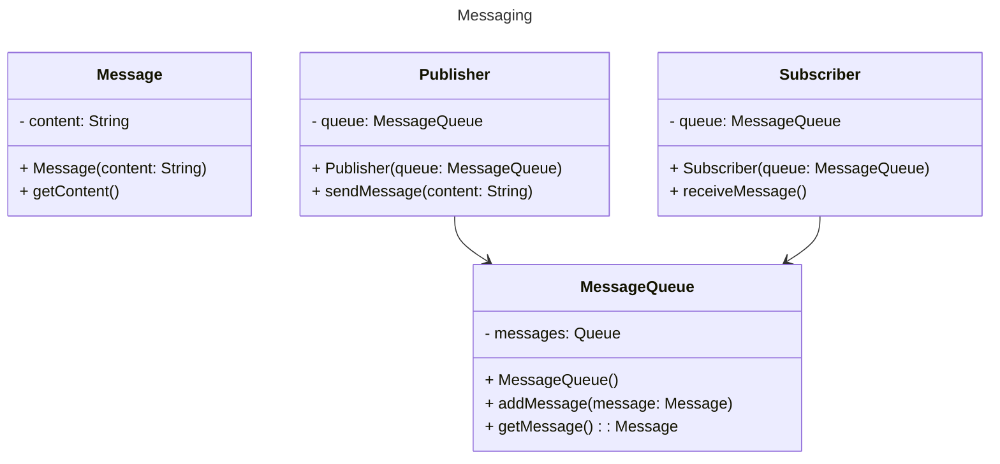
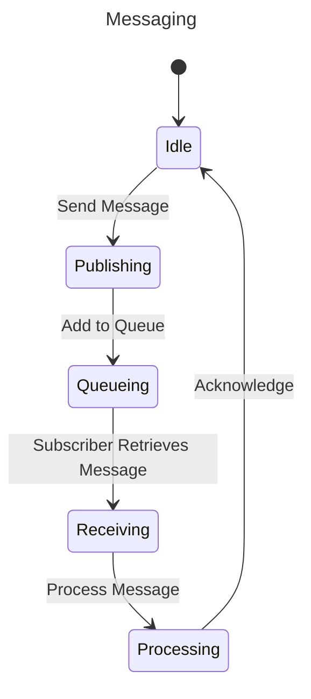

#  `Messaging`

###  Призначення та застосування шаблону
#### **Messaging** — це шаблон проєктування, який забезпечує асинхронну передачу повідомлень між компонентами системи. Основна ідея полягає в тому, що відправник і отримувач повідомлення не залежать один від одного, що дозволяє створювати масштабовані та надійні системи.
###### Messaging зменшує зв'язність між компонентами, дозволяючи їм взаємодіяти через черги повідомлень або брокери.
#### **Застосовується :**
- у **розподілених системах**, де необхідно забезпечити обмін даними між сервісами без прямої залежності;
- у **обробці подій**, коли компоненти мають реагувати на певні дії в системі;
- у **інтеграційних рішеннях**, де необхідно передавати повідомлення між різними системами або мікросервісами.

### Діаграми класів та стану

##### Class Diagram Messaging:

##### State Diagram Messaging:

### Опис основних структурних елементів:
- **Message** - представляє передане повідомлення з певним вмістом.
- **Publisher** - відправляє повідомлення в чергу для подальшої обробки.
- **Subscriber** - отримує повідомлення з черги та обробляє його.
- **MessageQueue** - черга повідомлень, яка зберігає та управляє обміном повідомлень між відправниками і отримувачами.

###### На діаграмі станів зображено загальний життєвий цикл повідомлення в системі.

### Джерела інформації:
##### - [enterpriseintegrationpatterns.com](https://www.enterpriseintegrationpatterns.com/patterns/messaging/)
##### - [martinfowler.com](https://martinfowler.com/eaaDev/EventDrivenArchitecture.html)
##### - [aws.amazon.com](https://aws.amazon.com/sqs/)

